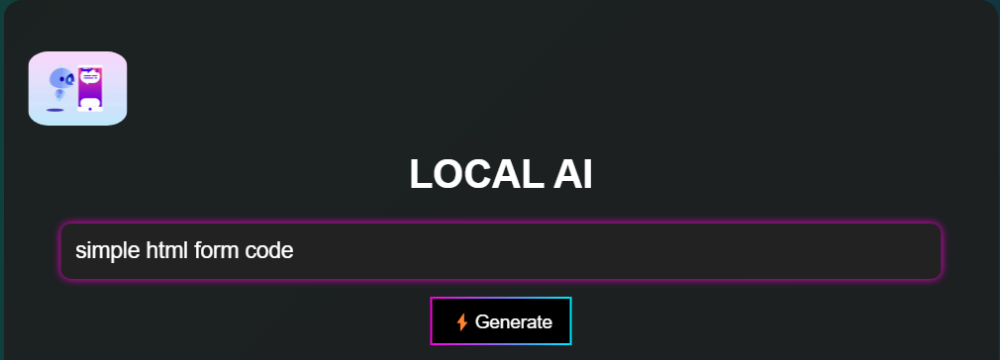
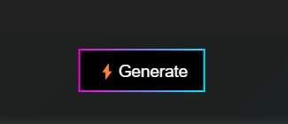
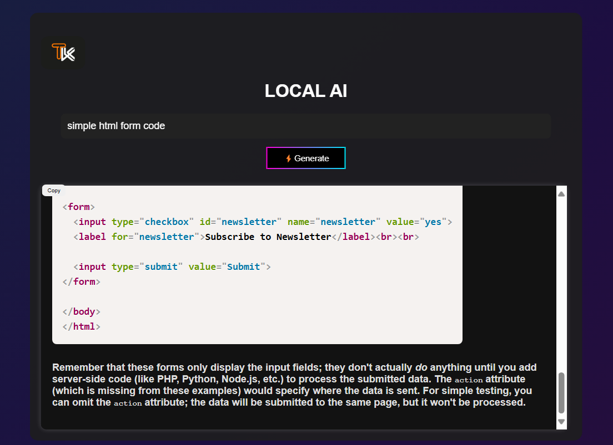
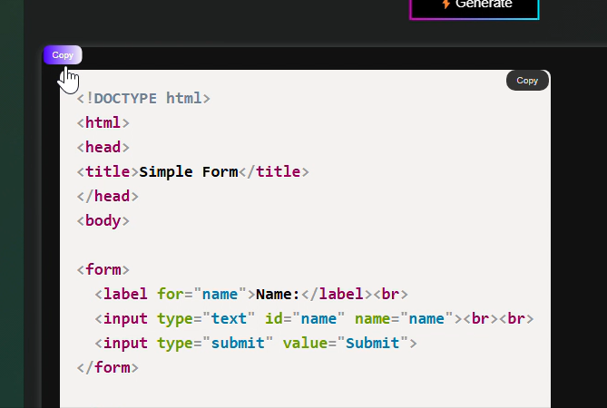
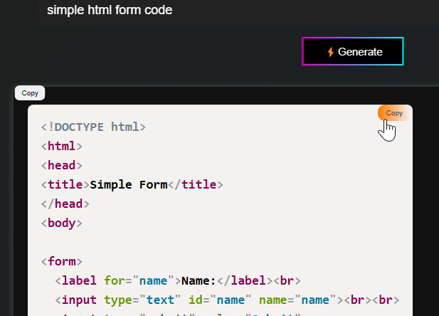

# Local AI 🤖

Local AI is a privacy-focused web application that enables you to interact with Large Language Models (LLMs) while keeping your data secure. Unlike cloud-based AI services, Local AI processes all queries locally, ensuring complete confidentiality.

## ✨ Features  

- **Privacy-Focused** – Runs entirely on your local machine, keeping your data confidential.  
- **User-Friendly Interface** – A sleek and intuitive web UI for seamless interaction with LLMs.  
- **Code Block Highlighting** – Displays code snippets with proper formatting for better readability.  
- **One-Click Copy** – Easily copy the entire response or individual code snippets.  
- **Conversation History** – Retains previous interactions locally for easy reference.  
- **Loading Indicator** – Provides visual feedback during API requests.  

## 🎥 Demo  

Check out the demo video showcasing Local AI in action:  

<video width="600" controls>
  <source src="sample/DEMO.mp4" type="video/mp4">
  Your browser does not support the video tag.
</video>

## 🔧 Prerequisites  

Before running the application, ensure you have the following:  

- **Python 3.x** installed  
- **Flask**, **Requests**, and **Tenacity** libraries  
- **LLM API Key** (set as an environment variable `LLM_API_KEY`)  

## 🚀 Installation  

Follow these steps to set up and run Local AI:  

### 1️⃣ Clone the Repository  

```bash
git clone https://github.com/Tejas7k/LocalAI.git
cd LocalAI
```

### 2️⃣ Create a Virtual Environment (Recommended)  

```bash
python3 -m venv venv
source venv/bin/activate  # macOS/Linux
venv\Scripts\activate     # Windows
```

### 3️⃣ Install Dependencies  

```bash
pip install -r requirements.txt
```

### 4️⃣ Set Up API Key  

Set your LLM API Key as an environment variable:  

```bash
export LLM_API_KEY="YOUR_API_KEY"  # macOS/Linux
set LLM_API_KEY="YOUR_API_KEY"     # Windows
```

For PowerShell:  
```powershell
$env:LLM_API_KEY = "YOUR_API_KEY"
```

### 5️⃣ Run the Application  

```bash
python app.py
```

### 6️⃣ Access the Web Interface  

Open your browser and navigate to:  

```
http://127.0.0.1:5000/
```

## 🎯 Usage  

### 🔹 Enter Your Query  
  
Type your query in the input field.  

### 🔹 Click "Generate"  
  
Click the "Generate" button to process your request.  

### 🔹 View the Response  
  
Generated content will be displayed in the response area.  

### 🔹 Copy the Response  
  
Click the **Copy Response** button to copy the full output.  

### 🔹 Copy Code Blocks  
  
Copy individual code snippets with the **Copy** button.  

## 🤝 Contributing  

Contributions are welcome! Feel free to submit pull requests or report issues.  

## 📜 License  

This project is licensed under the MIT License. See the [LICENSE](License)

## 🙌 Acknowledgments  

This project was made possible with the help of the following technologies:  

- [Python](https://www.python.org/) – The core programming language used in this project.  
- [Flask](https://flask.palletsprojects.com/) – A lightweight WSGI web framework for Python.  
- [Requests](https://docs.python-requests.org/en/latest/) – For handling API requests.  
- [Tenacity](https://tenacity.readthedocs.io/en/latest/) – For handling retries and failures.  
- [LLM API](https://platform.openai.com/docs/) – Used for generating AI-powered responses.  
- [LLM Privacy](https://www.llmprivacy.com/) – Ensuring data security and privacy for AI interactions.  


🚀 _Developed with ❤️ for privacy-conscious AI users._
